<!-- PROJECT SHIELDS -->
<a id="readme-top"></a>
[![Contributors][contributors-shield]][contributors-url]
[![Forks][forks-shield]][forks-url]
[![Stargazers][stars-shield]][stars-url]
[![Issues][issues-shield]][issues-url]
[![LinkedIn][linkedin-shield]][linkedin-url]

<!-- PROJECT LOGO -->
<br />
<div align="center">
  <a href="https://github.com/pranavbisaria/HealthHive">
    
  </a>
<h3 align="center">HealthHive</h3>
  <p align="center">
    A decentralized health care partner.<br>Unleash the power of meds, with cutting edge technology ahead
    <br />
    <a href="https://github.com/pranavbisaria/HealthHive"><strong>Explore the docs »</strong></a>
    <br />
    <br />
    <a href="https://pranavbisaria.github.io/HealthHive">View Demo</a>
    ·
    <a href="https://github.com/pranavbisaria/HealthHive/issues">Report Bug</a>
    ·
    <a href="https://github.com/pranavbisaria/HealthHive/issues">Request Feature</a>
  </p>
</div>


<!-- TABLE OF CONTENTS -->
<details>
  <summary>Table of Contents</summary>
  <ol>
    <li>
      <a href="#about-the-project">About The Project</a>
      <ul>
        <li><a href="#built-with">Built With</a></li>
      </ul>
    </li>
    <li>
      <a href="#getting-started">Getting Started</a>
      <ul>
        <li><a href="#prerequisites">Prerequisites</a></li>
        <li><a href="#installation">Installation</a></li>
      </ul>
    </li>
    <li><a href="#usage">Usage</a></li>
    <li><a href="#roadmap">Roadmap</a></li>
    <li><a href="#contributing">Contributing</a></li>
    <li><a href="#contact">Contact</a></li>
    <li><a href="#acknowledgments">Acknowledgments</a></li>
  </ol>
</details>


<!-- ABOUT THE PROJECT -->
<a id="about-the-project"></a>
## About The Project
<div style="text-align: center; font-size: 20px">
    <a href="https://www.figma.com/file/vXEbkGuapNYJYmHjAbly6h/HealthHive?node-id=4%3A311&t=yveGyp07St4XrpEQ-0"><b>>> Click to view Figma Designs <<</b></a>
</div>
<div style="border: 1px solid #575757;
    padding: 20px;
    overflow: hidden;
    max-width: 900px;
    width: 100%;
    margin: 0 auto;
    position: relative;
    display: flex;
    flex-wrap: wrap;
    justify-content: space-evenly;">
    
    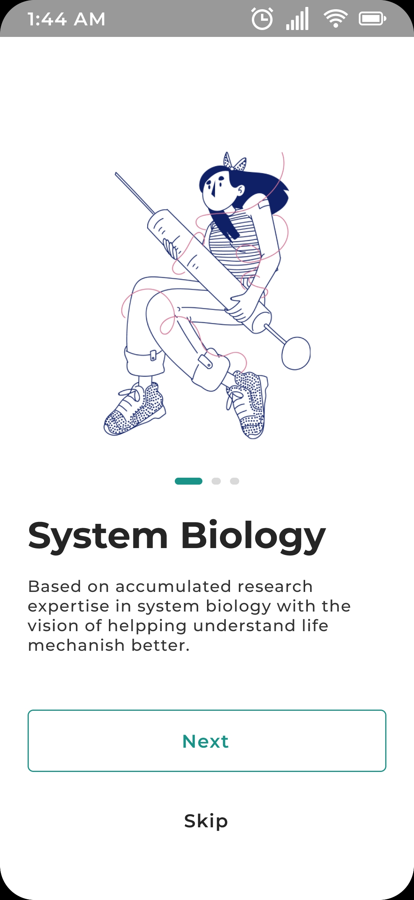
    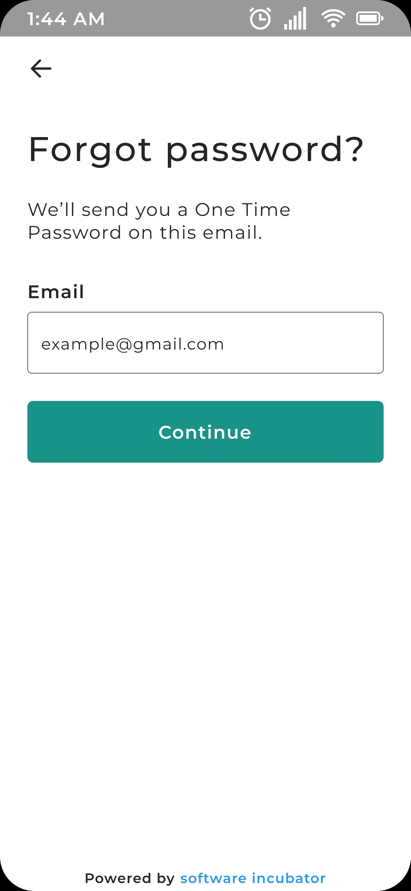
    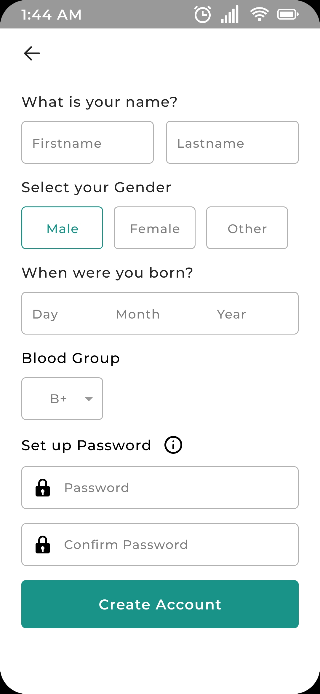
    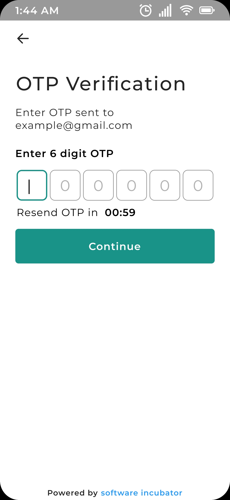
    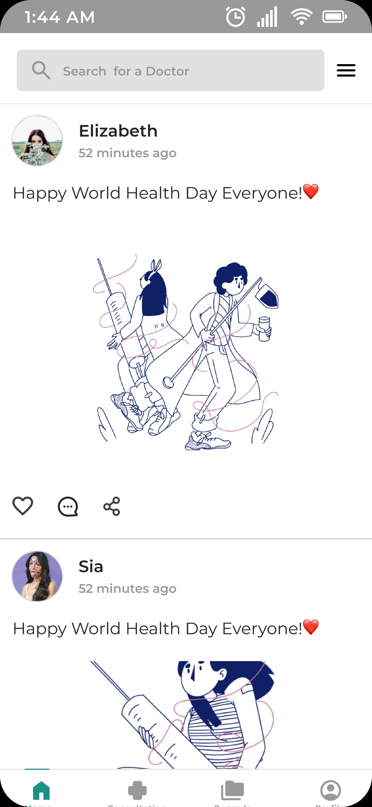
    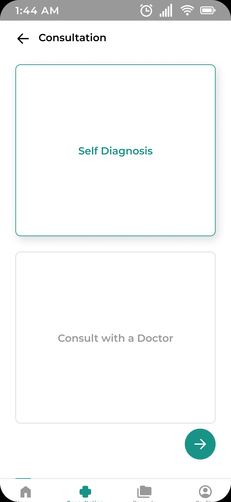
    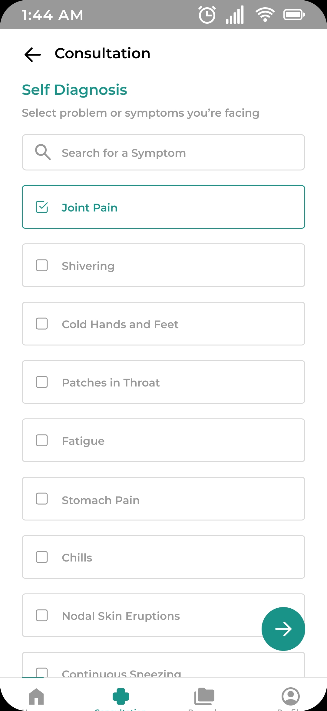
    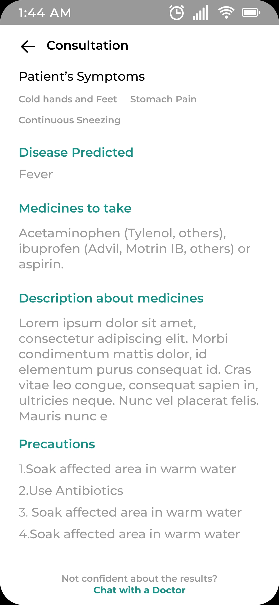
    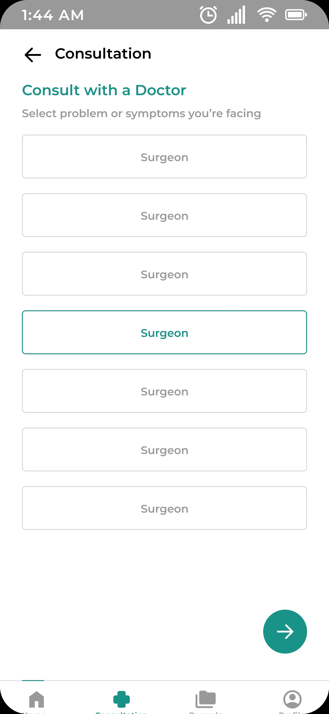
    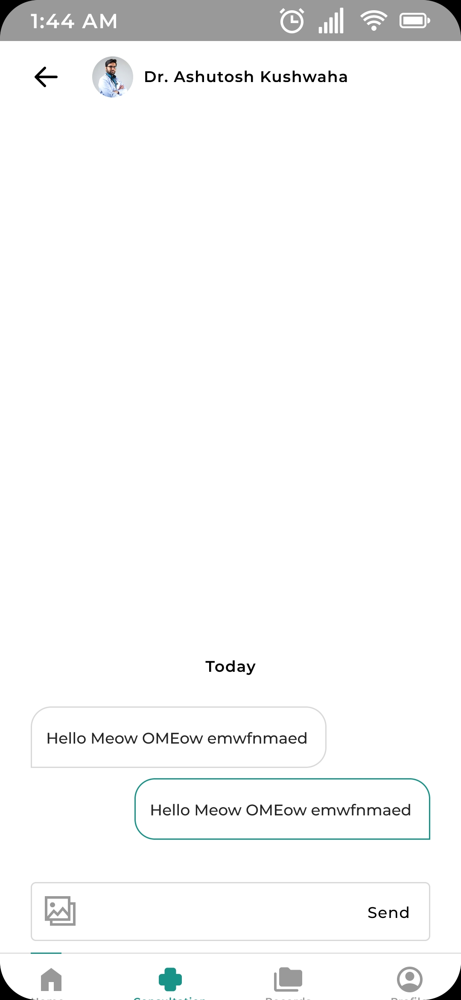
    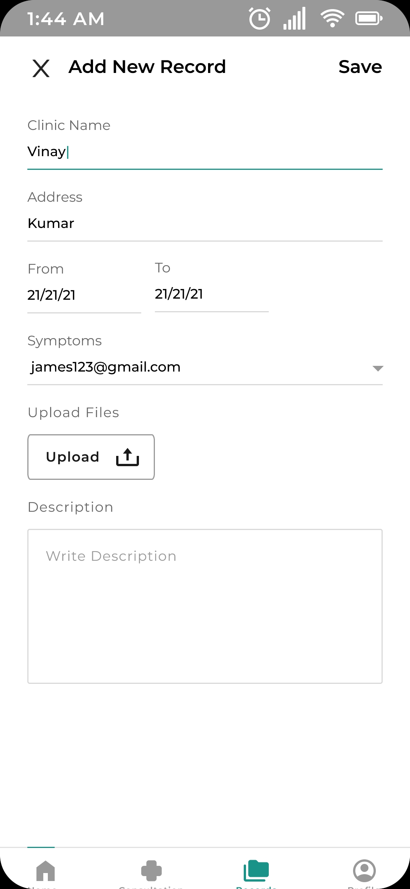
</div>
An AI-powered personalized medicine platform that leverages blockchain technology to securely store and share medical data.
<p align="right">(<a href="#readme-top">back to top</a>)</p>


<a id="built-with"></a>
### Built With

* [![Kotlin][Kotlinlang.org]][Kotlin-url]
* [![Springboot][Spring.io]][Springboot-url]
* [![JWT][JWT.io]][JWT-url]
* [![Websockets][websocket.io]][websocket-url]
* [![RazorPay][Razorpay.com]][Razorpay-url]
* [![Twilio][Twilio.com]][Twilio-url]
* [![AWS][aws.amazon.com]][Amazon-url]
* [![Postgres][Postgresql.org]][Postgres-url]

<p align="right">(<a href="#readme-top">back to top</a>)</p>


<!-- GETTING STARTED -->
<a id="getting-started"></a>
## Getting Started

This is an example of how you can use my APIs on setting up my project locally.
To get a local copy up and running follow these simple steps.

### Prerequisites
<a id="prerequisites"></a>

You only need to install the JAVA 17.0.5 LTS from Oracle, go to the following link and install for your operating system

```sh
https://www.oracle.com/java/technologies/javase/jdk17-archive-downloads.html
```

### Installation
<a id="installation"></a>

1. Get the JAVA 17.0.5: [https://www.oracle.com/](https://www.oracle.com/java/technologies/javase/jdk17-archive-downloads.html)
2. Set up the postgres database (local database): [https://www.postgresql.org/](https://www.postgresql.org/)
3. Clone the repo
   ```sh
   git clone https://github.com/pranavbisaria/HealthHive.git
   ```
4. Open the cloned folder using STS, IntelliJ Idea or any other IDE, and it will auto download all the configuration files.
5. Replace the database links, razorpay API keys of your own, twilio API keys, google Oauth2 API keys and AWS S3-Bucket API keys.
6. Run the project, the base URL for the project will be
   ```sh
   http://localhost:8080/
   ```
7. Get the documentation for the various APIs at the following link
   ```sh
   http://localhost:8080/swagger-ui/index.html
   ```

<p align="right">(<a href="#readme-top">back to top</a>)</p>


<!-- USAGE EXAMPLES -->
<a id="usage"></a>
## Usage

This repository contain complete code to built and run Healthhive application.

To access the APIs
Postman Collection - https://www.postman.com/crimson-flare-571775/workspace/healthive-backend/collection/24017701-42c3a555-e7f6-4a15-b0c0-c631472fce88?action=share&creator=24017701

_For more examples, please refer to the [Documentation](https://www.shopitanywhere.live/swagger-ui/index.html)_

<p align="right">(<a href="#readme-top">back to top</a>)</p>

<!-- ROADMAP -->
<a id="roadmap"></a>
## Roadmap

- [ ] Add, update and delete products
- [ ] Role based user model
   - [ ] Admin
   - [ ] Customer
   - [ ] Merchant
- [ ] Manage files and json input in the same API
- [ ] Multiple files in the same API
- [ ] Spring Boot Security
   - [ ] Component Based Security Model (2023)
   - [ ] JWT token (Access and Refresh Token)
   - [ ] Oauth2 Google Login
- [ ] Razorpay Payment Integration
- [ ] Asynchronous Method calling for faster API response
- [ ] Push Notification
   - [ ] Using websockets + stomp client
   - [ ] Using firebase
- [ ] Hosted on AWS EC2 VM
   - [ ] Springboot as a service

See the [open issues](https://github.com/pranavbisaria/HealthHive/issues) for a full list of proposed features (and known issues).

<p align="right">(<a href="#readme-top">back to top</a>)</p>


<!-- CONTRIBUTING -->
<a id="contributing"></a>
## Contributing

Contributions are what make the open source community such an amazing place to learn, inspire, and create. Any contributions you make are **greatly appreciated**.

If you have a suggestion that would make this better, please fork the repo and create a pull request. You can also simply open an issue with the tag "enhancement".
Don't forget to give the project a star! Thanks again!

1. Fork the Project
2. Create your Feature Branch (`git checkout -b feature/AmazingFeature`)
3. Commit your Changes (`git commit -m 'Add some AmazingFeature'`)
4. Push to the Branch (`git push origin feature/AmazingFeature`)
5. Open a Pull Request

<p align="right">(<a href="#readme-top">back to top</a>)</p>

<!-- CONTACT -->
<a id="contact"></a>
## Contact

Pranav Bisaria - [@pranavbisaria29](https://twitter.com/pranavbisaria29) - [pranavbisariya29@gmail.com](mailto:pranavbisariya29@gmail.com)

Project Link: [https://github.com/pranavbisaria/HealthHive](https://github.com/pranavbisaria/HealthHive)

<p align="right">(<a href="#readme-top">back to top</a>)</p>


<!-- ACKNOWLEDGMENTS -->
<a id="acknowledgments"></a>
## Acknowledgments

* [https://start.spring.io/](https://start.spring.io/)
* [https://www.baeldung.com/spring-boot](https://www.baeldung.com/spring-boot)
* [https://www.baeldung.com/spring-boot-security-autoconfiguration](https://www.baeldung.com/spring-boot-security-autoconfiguration)
* [https://spring.io/guides/gs/messaging-stomp-websocket/](https://spring.io/guides/gs/messaging-stomp-websocket/)

<p align="right">(<a href="#readme-top">back to top</a>)</p>

<!-- MARKDOWN LINKS & IMAGES -->
<!-- https://www.markdownguide.org/basic-syntax/#reference-style-links -->
[contributors-shield]: https://img.shields.io/github/contributors/pranavbisaria/HealthHive.svg?style=for-the-badge
[contributors-url]: https://github.com/pranavbisaria/HealthHive/graphs/contributors
[forks-shield]: https://img.shields.io/github/forks/pranavbisaria/HealthHive.svg?style=for-the-badge
[forks-url]: https://github.com/pranavbisaria/HealthHive/network/members
[stars-shield]: https://img.shields.io/github/stars/pranavbisaria/HealthHive.svg?style=for-the-badge
[stars-url]: https://github.com/pranavbisaria/HealthHive/stargazers
[issues-shield]: https://img.shields.io/github/issues/pranavbisaria/HealthHive.svg?style=for-the-badge
[issues-url]: https://github.com/pranavbisaria/HealthHive/issues
[license-shield]: https://img.shields.io/github/license/pranavbisaria/HealthHive.svg?style=for-the-badge
[license-url]: https://github.com/pranavbisaria/HealthHive/blob/master/LICENSE.txt
[linkedin-shield]: https://img.shields.io/badge/-LinkedIn-black.svg?style=for-the-badge&logo=linkedin&colorB=555
[linkedin-url]: https://www.linkedin.com/in/pranavbisaria
[Kotlinlang.org]: https://img.shields.io/badge/kotlin-%237F52FF.svg?style=for-the-badge&logo=kotlin&logoColor=white
[Kotlin-url]: https://kotlinlang.org/
[Spring.io]: https://img.shields.io/badge/Spring_Boot-F2F4F9?style=for-the-badge&logo=spring-boot
[Springboot-url]: https://spring.io/
[JWT.io]: https://img.shields.io/badge/JWT-black?style=for-the-badge&logo=JSON%20web%20tokens
[JWT-url]: https://jwt.io/
[websocket.io]: https://img.shields.io/badge/Socket.io-black?style=for-the-badge&logo=socket.io&badgeColor=010101
[websocket-url]: https://socket.io/
[Razorpay.com]: https://img.shields.io/badge/Razorpay-02042B?style=for-the-badge&logo=razorpay&logoColor=3395FF
[Razorpay-url]: https://dashboard.razorpay.com/
[Twilio.com]: https://img.shields.io/badge/Twilio-F22F46?style=for-the-badge&logo=Twilio&logoColor=white
[Twilio-url]: https://www.twilio.com/
[Postgresql.org]: https://img.shields.io/badge/PostgreSQL-316192?style=for-the-badge&logo=postgresql&logoColor=white
[Postgres-url]: https://www.postgresql.org/
[aws.amazon.com]: https://img.shields.io/badge/Amazon_AWS-FF9900?style=for-the-badge&logo=amazonaws&logoColor=white
[Amazon-url]: https://aws.amazon.com/
